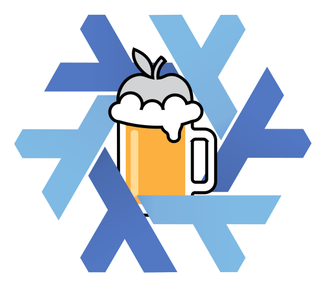

# home-manager-brew

This nix flake contains a home-manager module that allows you to install and
manage [homebrew](https://brew.io) packages (formulae, cask, taps, mas, ...)
with [home-manager](https://github.com/nix-community/home-manager).



The goal is to extends nix and home-manager configuration. Some applications
are not yet available for nix but those are already on brew, or if you have
custom/private taps and you would still be able to set them up with
home-manager.

The module will automatically install homebrew and aims to provide a bridge
between [Brew Budlefile](https://docs.brew.sh/Brew-Bundle-and-Brewfile) and
nix's reproducible setup, with configuration as code.

## Install

In your `flake.nix` configuration add the following input:

```nix
inputs = {

  homebrew = {
    url = "github:koalalorenzo/home-manager-brew";
    inputs.nixpkgs.follows = "nixpkgs";
  };

};
```

Then update your config to load the nix module in your home-manager configuration:

```nix
outputs = {...} @ inputs: {

  packages.homeConfigurations."yourusername" = home-manager.lib.homeManagerConfiguration {
    # [...]
    modules = [
      # adds homebrew module
      inputs.homebrew.homeManagerModules.default
    ];
  };

};
```

> [!CAUTION]
> If you have already packages installed please [read carefully how to import
> existing packages](#importing-from-existing-brew-setup). By default,
> home-manager will uninstall packages installed manually, unless they are
> specified as code in the nix configuration

# Usage

You can add specific [formulae](https://formulae.brew.sh) / packages like this:

```nix
homebrew.formulae = [
  "cmatrix"
];
```

## Taps
If you want to add taps you can do so like this:

```nix
homebrew.taps = [
  {
    name = "custom/tap";
    repo = "git@github.com:custom/homebrew-tap.git";
  }
];
```

Then you can install packages like you would with brew install:

```nix
homebrew.formulae = [
  "custom/tap/cmatrix"
];
```

## Casks

Similarly to formulae you can specify casks to install:

```nix
homebrew.casks = [
  "vlc"
];
```

## MAS (Mac App Store)

If you want to use the homebrew [mas](https://github.com/mas-cli/mas) integration
you can by specifying the name and the ID of the applications, like so:

```nix
homebrew.mas = [
  {
    name = "Meshtastic";
    id = 1586432531;
  }
  {
    name = "LanguageTool";
    id = 1534275760;
  }
]
```

You can obtain the ID of the application from the Mac App Store by using the
`mas` command:

```nix
$ mas list
1586432531  Meshtastic            (2.7.6)
1534275760  LanguageTool          (8.21.1)
```

## Importing from existing Brew setup

If you have an existing homebrew configuration, you can generate a brew bundle
file to use to create the nix home-manager configuration. You can generate
the brew bundle file with this command:

```bash
brew bundle dump --file=- --mas --cask --brew
```

The output of the command will show something similar to this:

```
brew "cmatrix"
cask "vlc"
mas "LanguageTool", id: 1534275760
mas "Meshtastic", id: 1586432531
```

By default if you don't import the existing bundle in the home-manager nix
configuration, it will delete all the apps. This is to follow as close as
possible the reproducible principle of Nix, and have full configuration as code.
To prevent this, you can disable the cleanup:

```nix
  homebrew.cleanup = false;
```

# License

This project is licensed under the terms of the [MIT license](./LICENSE).
